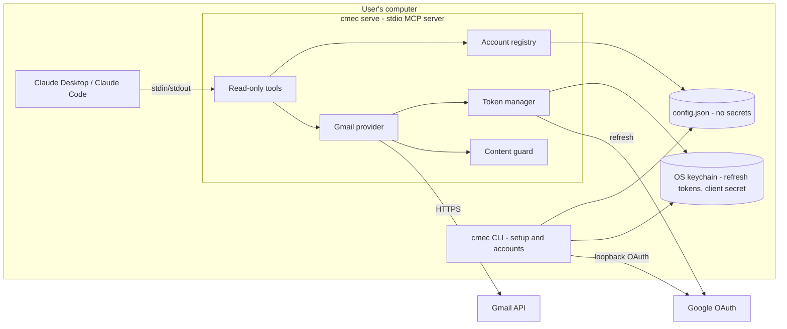
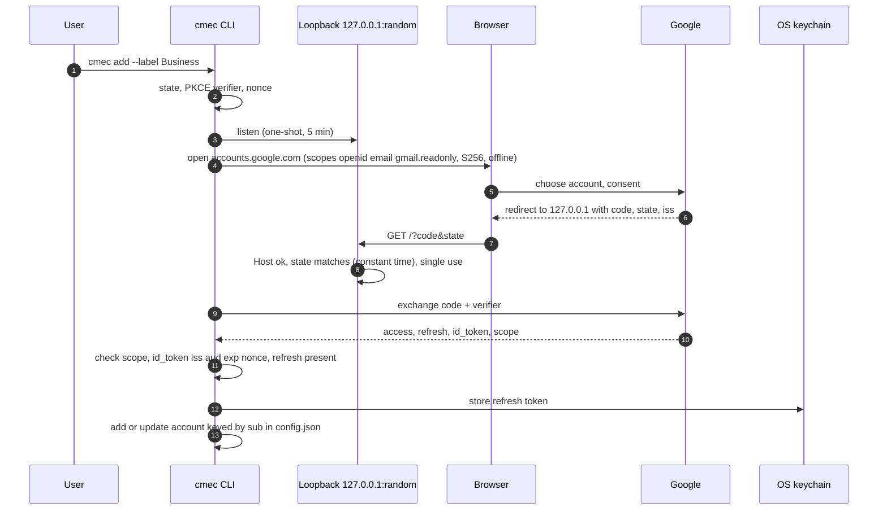
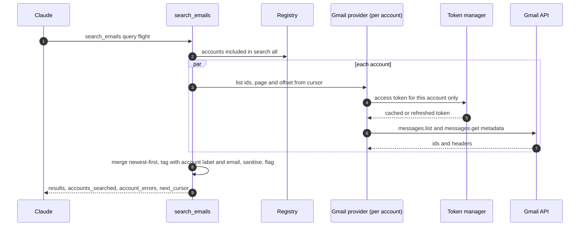

# Architecture diagrams (local edition)

Mermaid diagrams; they render on GitHub.

## 1. Components on the user's computer

```mermaid
flowchart LR
    subgraph pc[User's computer]
        claude[Claude Desktop / Claude Code]
        subgraph srv[cmec serve - stdio MCP server]
            tools[Read-only tools]
            reg[Account registry]
            tok[Token manager]
            gmailp[Gmail provider]
            guard[Content guard]
        end
        cli[cmec CLI - setup and accounts]
        cfg[(config.json - no secrets)]
        kc[(OS keychain - refresh tokens, client secret)]
    end
    google[Google OAuth]
    gmail[Gmail API]

    claude -- stdin/stdout --> tools
    tools --> reg --> cfg
    tools --> gmailp --> tok --> kc
    gmailp --> guard
    tok -- refresh --> google
    gmailp -- HTTPS --> gmail
    cli --> cfg
    cli --> kc
    cli -- loopback OAuth --> google
```

## 2. Connecting an account

```mermaid
sequenceDiagram
    autonumber
    participant U as User
    participant C as cmec CLI
    participant L as Loopback 127.0.0.1:random
    participant B as Browser
    participant G as Google
    participant K as OS keychain
    U->>C: cmec add --label Business
    C->>C: state, PKCE verifier, nonce
    C->>L: listen (one-shot, 5 min)
    C->>B: open accounts.google.com (scopes openid email gmail.readonly, S256, offline)
    B->>G: choose account, consent
    G-->>B: redirect to 127.0.0.1 with code, state, iss
    B->>L: GET /?code&state
    L->>L: Host ok, state matches (constant time), single use
    C->>G: exchange code + verifier
    G-->>C: access, refresh, id_token, scope
    C->>C: check scope, id_token iss aud exp nonce, refresh present
    C->>K: store refresh token
    C->>C: add or update account keyed by sub in config.json
```

## 3. Searching all accounts

```mermaid
sequenceDiagram
    autonumber
    participant Cl as Claude
    participant T as search_emails
    participant R as Registry
    participant P as Gmail provider (per account)
    participant M as Token manager
    participant G as Gmail API
    Cl->>T: search_emails query flight
    T->>R: accounts included in search all
    par each account
        T->>P: list ids, page and offset from cursor
        P->>M: access token for this account only
        M-->>P: cached or refreshed token
        P->>G: messages.list and messages.get metadata
        G-->>P: ids and headers
    end
    T->>T: merge newest-first, tag with account label and email, sanitise, flag
    T-->>Cl: results, accounts_searched, account_errors, next_cursor
```
